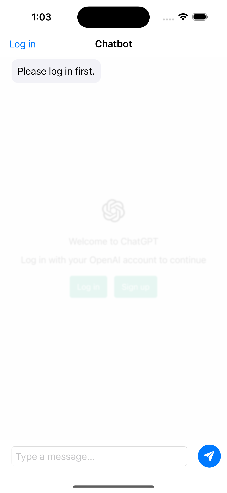
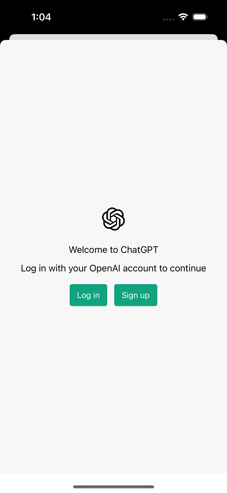

# ChatGPT Chatbot for iOS

## Introduction

This is an iOS application for interacting with ChatGPT using SwiftUI, WebKit WebView and JavaScript without the need for a backend service.

This project uses JavaScript injection in the WebView to simulate user interactions with the website, allowing you to send messages and retrieve information in real time.

## Features

- Log in to ChatGPT without being blocked by Cloudflare
- Beautiful and intuitive user interface built using SwiftUI
- Fully programmable, allowing you to customize and extend the app's functionality to suit your needs

## Screenshots

